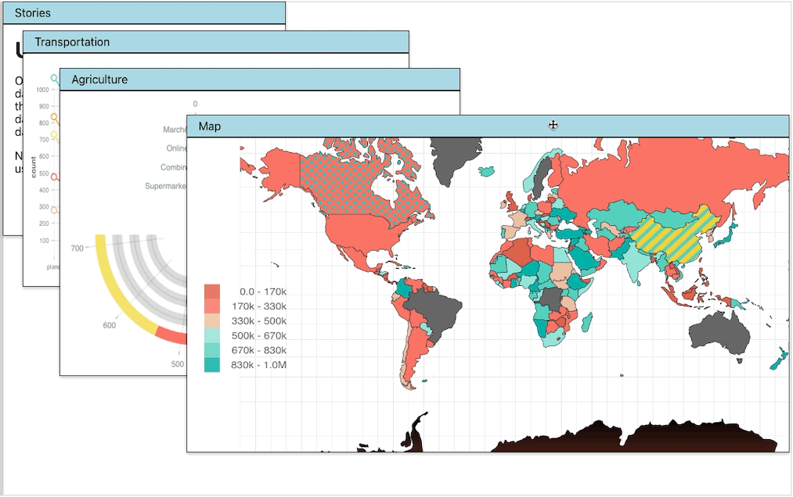
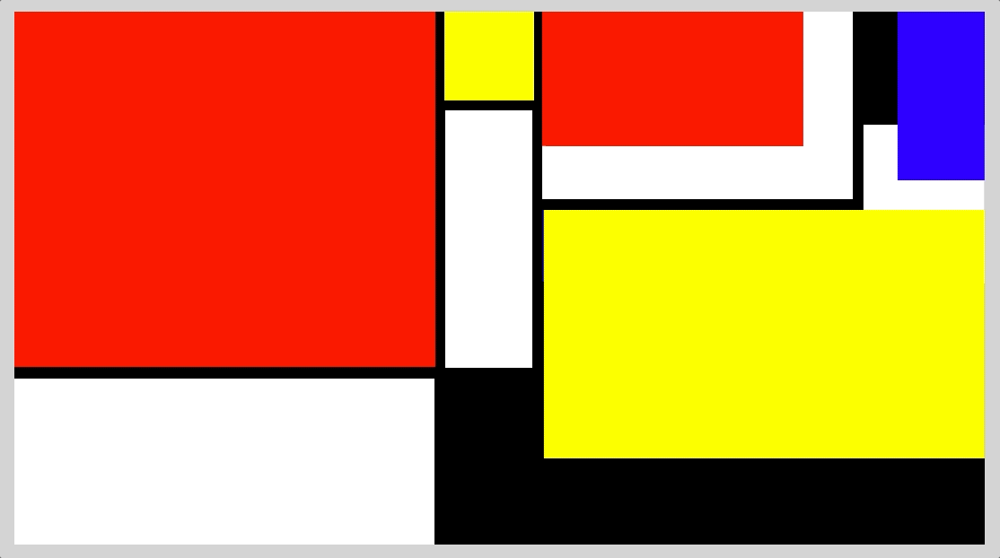

<a name="readme-top"></a>

<!-- SPLASH -->
<div align="center">
  
  <h3 align="center">react-pro-panels</h3>
  <p align="center">
    A Higher-Order Component wrapper that to make any component resizable, draggable, and persistent!
    <br />
    <a href="https://www.npmjs.com/package/react-pro-panels"><strong>See project on npm »</strong></a>
  </p>
</div>


<!-- TABLE OF CONTENTS -->
<details>
  <summary>Table of Contents</summary>
  <ol>
    <li><a href="#about-the-project">About The Project</a></li>
    <li><a href="#installation">Installation</a></li>
    <li><a href="#usage">Usage</a></li>
    <li><a href="#change-log">Change Log</a></li>
    <li><a href="#contact">Contact</a></li>
  </ol>
</details>


<!-- ABOUT THE PROJECT -->
## About The Project

React Pro Panels provides a way for developers to quickly and easily make their components resizable, draggable, and seamlessly overlay with other components. The package features a Higher-Order Component that will wrap any component.  The wrapper can be moved around the screen easily, freeing the developer from having to worry about where to place the component on the screen.  

Here's an example of react-pro-panels in action:


You might notice a few major benefits:
- The wrapper component handles Z-indexes for you, so that a user only needs to click on the panel to bring it to the front.
- Clicking, dragging, and resizing all work intuitively, just as you would expect any panels or windows to operate, just like a native operating system.
- If using the "ProPanelContainer" component, the panels will also remember their sizes and positions after being removed from the DOM and re-added the the DOM.  (In the example, the buttons on the left trigger conditional rendering for the panels)

<br>
<br>

### Why react-pro-panels?
React-Pro-Panels uses react-rnd as a dependency to enable the positioning and resizing, but react-rnd requires you to import it into every component's page and use a lot of boilerplate code. Additionally, react-rnd is applied to each component independently, so you can not easily specify how the panels should overlay each other.  React-Pro-Panels makes this process easy!

Here's a sample of some Mondrian Art a user can get up and running super easily:


<p align="right">(<a href="#readme-top">back to top</a>)</p>


<!-- Installation -->
## Installation

```
npm install react-pro-panels react-rnd
```

  <p align="right">(<a href="#readme-top">back to top</a>)</p>


<!-- USAGE EXAMPLES -->
## Usage
Import the Pro Panel into any component that you would like to wrap to become resizable / draggable.  
Make sure to wrap your component when exporting.
```
import withProPanel from "react-pro-panels";

const ExampleComponent = () => {
    return (
        <h1>Hello World!</h1>
    )
}
export default withProPanel(ExampleComponent);

```
Note: notice that the wrapper component is imported as "withProPanel" which is a naming convention for higher-order-components.

<br>
<br>

Import the Wrapper component to add to your project, then simply place any of your Pro Panels inside.  The "defaults" prop defines the initial size and position of your component within the parent ProPanelContainer.

```
import { ProPanelContainer } from "react-pro-panels";
import ExampleComponent from "./ExampleComponent";

const App = () => {
    return (
        <div id="app">
            <ProPanelContainer>
                <ExampleComponent defaults={{name: "red-box", x: 100, y: 100, height: "100px", width: "100px"}}>
                <ExampleComponent defaults={{name: "blue-box", x: 0, y: 0, height: "5rem", width: "2rem"}}>
                <ExampleComponent defaults={{name: "green-box", x: 50, y: 50, height: "50vh", width: "50vw"}}>
            </ProPanelContainer>
        </div>
    )
}
``````

### Props
```
defaults={ name, x, y, height, width}
```
- name: defines name of the component, used for storing position for when component is removed and added back to the DOM.
- x: initial X position relative to parent container
- y: initial Y position relative to parent container
- height: initial height of component
- width: initial width of component


<p align="right">(<a href="#readme-top">back to top</a>)</p>


<!-- Change Log -->
## Change Log

- [v1.0.1] README added
- [v1.0.0] Project created and published to NPM

<p align="right">(<a href="#readme-top">back to top</a>)</p>


<!-- CONTACT -->
## Contact

Timothy Akana - [timothyakana.tech](https://www.timothyakana.tech/) - TimothyAkana@gmail.com

Project Link: [https://github.com/TimothyAkana/react-pro-panels](https://github.com/TimothyAkana/react-pro-panels)

npm Link: [https://www.npmjs.com/package/react-pro-panels](https://www.npmjs.com/package/react-pro-panels)

<p align="right">(<a href="#readme-top">back to top</a>)</p>
